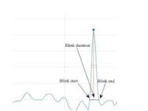

# Driver Fatigue Detection System

[](https://opensource.org/licenses/MIT)

A computer vision system that automatically detects driver drowsiness in real-time video streams using facial landmark detection and eye aspect ratio analysis.

## Features
- Real-time drowsiness detection
- Audio alarm notification
- Customizable sensitivity thresholds
- Works with webcam or video files

## Applications
- Prevent accidents caused by drowsy driving
- Can be integrated into vehicle safety systems
- Useful for long-haul truck drivers and night shift workers

## Requirements
- Python 2.7 or higher
- OpenCV
- dlib
- Other dependencies (see Installation)

## Installation

1. Clone the repository:
```bash
git clone https://github.com/IshikaJain17/Drowsiness-Detection-System.git
cd Fatigue-Detection-System
```

2. Install dependencies:
```bash
pip install -r requirements.txt
```

3. Download the facial landmark predictor:
```bash
wget http://dlib.net/files/shape_predictor_70_face_landmarks.dat.bz2
bunzip2 shape_predictor_70_face_landmarks.dat.bz2
mv shape_predictor_70_face_landmarks.dat models/
```

## Usage
To run the detection system:
```bash
python blinkDetect.py
```

Optional arguments:
- `--video`: Path to video file (default: webcam)
- `--threshold`: Eye aspect ratio threshold (default: 0.3)
- `--alarm`: Path to alarm sound file (default: alarm.wav)

## Technical Approach
The system uses:
1. Dlib's pre-trained frontal face detector (HOG + Linear SVM)
2. 70-point facial landmark detection
3. Eye Aspect Ratio (EAR) calculation
4. Temporal analysis of blink duration

### Algorithm Details
- Eye is considered open when EAR > threshold (~0.3)
- Normal blink duration: 200-300ms
- Drowsy blink duration: 800-900ms




## Project Structure
```
.
├── models/                  # Pre-trained models
├── vid/                     # Sample videos
├── blinkDetect.py           # Main detection script
├── main.py                  # Alternative implementation
├── alarm.wav                # Alert sound
└── README.md                # This file
```

## Future Improvements
- Add head pose estimation
- Implement PERCLOS metric
- Develop mobile app version
- Add cloud logging/alerting

## License
This project is licensed under the MIT License - see the [LICENSE](LICENSE) file for details.
